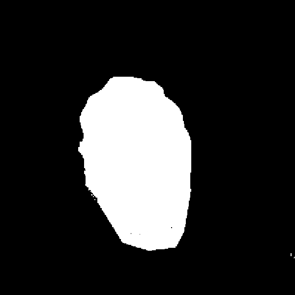
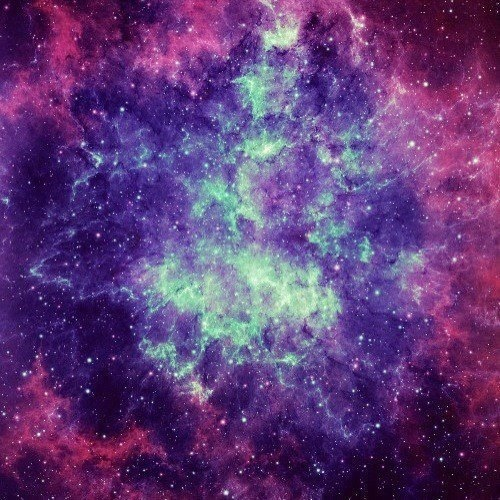

## Circle Painter

This program uses a background image to recreate a new target image.
A binary mask must also be passed to tell the program which parts to recreate.


|  |  |
|-|-|
|  |  |

### How it works
The program selects pixels from the target image and then calculates the
average color of different regions from the background image. The region
with the average color closest to the selected pixel value is then placed
where the pixel is on the image.


### Running
#### C++
First compile the script
```
./compile.sh
```

Then run
```
./main -t target_path -m mask_path -b background_path
```

#### Python
Run `main.py`. Edit the following variables at the bottom of the file

```python
mask_path = "imgs/john_mask.jpg"
target_path = "imgs/john.jpg"
background_path = "imgs/space.jpg"
```

To point to the files you want

### Dependencies
The C++ program uses `opencv` and `openmp`. It is the recommended way to run,
as it is much faster than the python implementation, specially on bigger images.

The python program uses `skimage`, `numpy` and `nptyping`.