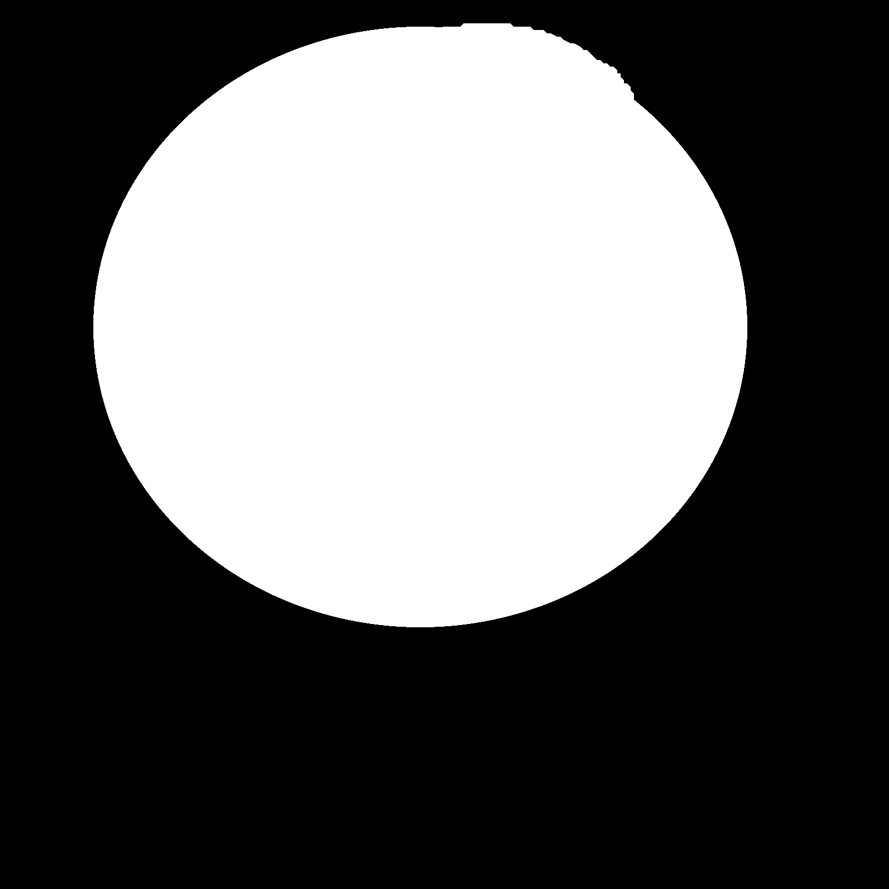

## Circle Painter

This program uses a background image to recreate a new target image.
A binary mask must also be passed to tell the program which parts to recreate.


|  |  |
|-|-|
|  |  |

### How it works
The program selects pixels from the target image and then calculates the
average color of different regions from the background image. The region
with the average color closest to the selected pixel value is then placed
where the pixel is on the image.


### Running
First compile the script
```
./compile.sh
```

Then run
```
./main -t target_path -m mask_path -b background_path -a alpha -s steps
```

Where 
- target_path is where the image to be painted is;
- mask_path is where the mask to what parts of the image to paint is;
- background_path is the path of the image to use to reconstruct the target;
- alpha is the maximum alpha (between 0 and 1);
- step is the amount of pixels to move when taking circles from the image;

There is also a (much) slower python version (it is not a wrapper, but instead a rewrite)
Run
```
python3 main.py -t target_path -m mask_path -b background_path -a alpha -s steps
```

### Dependencies
The C++ program uses `opencv` and `openmp`. It is the recommended way to run,
as it is much faster than the python implementation, specially on bigger images.

The python program uses `skimage`, `numpy` and `nptyping`.